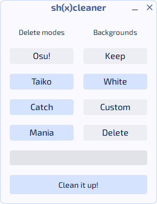

<div align="center">
<a href="README.md">English</a> | <strong>Русский</strong>
</div>

<br>

<h1 align="center">sh(x)cleaner</h1>

<p align="center">
  Очистка папки <code>Songs</code> в osu! от мусора всего в пару кликов.
</p>

<p align="center">
  
</p>

---

## Как использовать

1.  **Скачай:** последняя версия доступна [на странице релизов](https://github.com/shsh-x/sh-x-cleaner/releases/latest)
2.  **Запусти .exe:** клинер полностью портативный
3.  **Выбери `osu!.exe`:** при запуске очистки нужно указать путь к `osu!.exe`, чтобы автоматически найти папку `Songs` и не удалить ничего лишнего
4.  **Выбери режимы для удаления:** например, если играешь только в `Osu!`, отметь `Taiko`, `Catch` и `Mania`
5.  **Выбери фон:**
    *   **Keep (Оставить):** оставляет оригинальные фоны
    *   **White (Белый фон):** заменяет все фоны на простое белое изображение
    *   **Custom (Свой фон):** заменяет все фоны на твое собственное изображение (надо выбрать два изображения: png и jpg/jpeg)
    *   **Delete (Удалить):** удаляет все фоны (не рекомендуется)
6.  **Нажми "Clean it up!"** и жди завершения чистки
7. **Нажми F5 в селекторе** чтобы обновить состояние всех карт

---
## Дополнительные опции (для опытных пользователей)

Эти опции доступны через контекстное меню (правый клик по заголовку):

*   **Force Clean (Принудительная очистка):** проверяет и очищает все папки, даже если они были ранее почищены
*   **Keep Videos (Оставить видео):** сохраняет фоновые видео
*   **Dangerous Clean (Опасная очистка):** удаляет "мусорные" файлы из папок, у которых нет цифрового ID в названии **(используй с осторожностью!)**
*   **Ignore ID Limit (Игнорировать лимит ID):** обрабатывает папки с ID длиной 9 символов и более

---
## Запуск и сборка из исходного кода

Исполняемый файл не имеет цифровой подписи, поэтому некоторые антивирусы могут реагировать на него - это ложное срабатывание. Если ты не доверяешь `.exe` файлу, можешь легко запустить из исходников или собрать приложение самостоятельно.

1.  **Установи Python:** рекомендуется [Python 3.12+](https://www.python.org/downloads/)
2.  **Скачай код:** скачай и распакуй [архив с исходным кодом](https://github.com/shsh-x/sh-x-cleaner/archive/refs/heads/main.zip)
3.  **Создай виртуальное окружение:** в терминале в папке с проектом выполни
    ```shell
    python -m venv venv
    ```
4.  **Активируй окружение:**
    *   В **Windows**:
        ```shell
        .\venv\Scripts\activate
        ```
    *   В **Linux/macOS**:
        ```shell
        source venv/bin/activate
        ```
5.  **Установи зависимости:** с активированным окружением выполни
    ```shell
    pip install -r requirements.txt
    ```
6.  **Запусти или собери:**
    *   Чтобы **запустить** клинер, выполни
        ```shell
        python main.py
        ```
    *   Чтобы **собрать** свой `.exe` файл, выполни
        ```shell
        python build_exe.py
        ```
        Готовый файл появится в папке `dist`.

---

## Как это работает?

*   **Из папки с картой удаляются:**
    - Выбранные режиы
    - Все скины карт
    - Все хитсаунды 
    - Все видео (.mp4, .avi, .flv)
    - Все сториборды (.osb)
    - и все файлы, не имеющие отношения к карте
*   **Папка карты удаляется**, если после чистки в ней не остается ни одного .osu файла
*   **Фоны оптимизируются** путем замены всех изображений на символьные ссылки, каждый оригинал изображения хранится в едином экземпляре в отдельной папке внутри `Songs`
*   **Дубликаты удаляются**, если обнаруживаются папки с одинаковым ID карты, остаётся только одна (обычно последняя импортированная).
